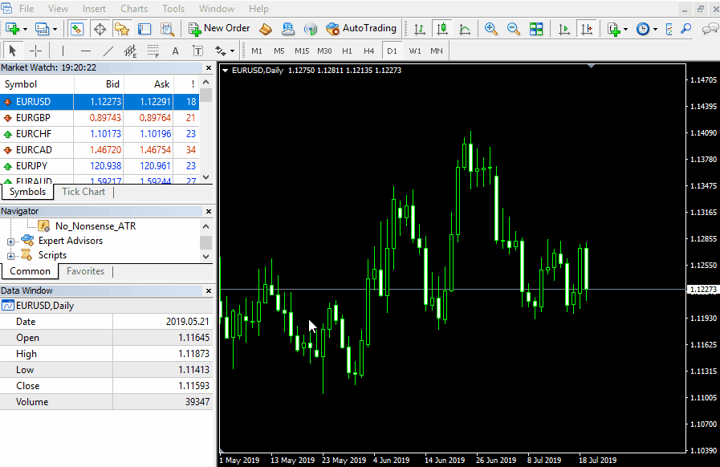
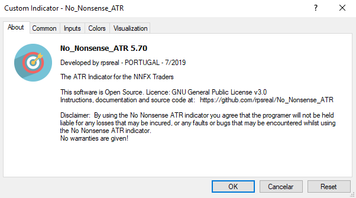
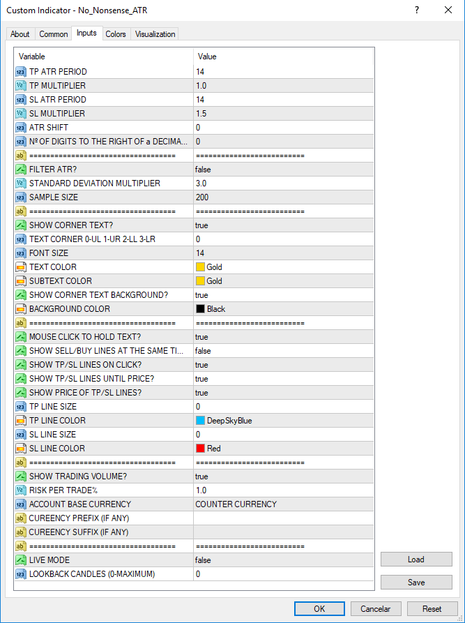
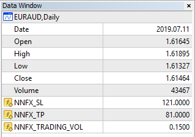
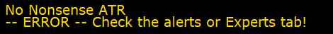

# No_Nonsense_ATR
## Overview

No Nonsense ATR is a tool designed to help the [NNFX Traders](https://nononsenseforex.com/) backtest strategies and trading in real time. **Last Version - 5.72**

The indicator calculates the value of the SL/TP based on the [ATR](https://nononsenseforex.com/indicators/the-worlds-best-forex-indicator/) allowing to verify the historical data in a simple and practical way, showing not only the SL/TP values but also the place where they would be and if it was a gain or loss. 
The No Nonsense ATR also calculates the trading volume required for each trade according to the desired risk, using the SL and the account currency for the calculation thus giving a more accurate value.


 

## Installation:
The No Nonsense ATR installation is exactly like any other indicator.
* In MT4 select "File" -> "Open Data Folder"
* Open the "MQL4" folder and then the "Indicators" folder
* Download the indicator by clicking on the ["No_Nonsense_ATR.ex4"](./No_Nonsense_ATR.ex4) file and then "Download"
* Copy the [No_Nonsense_ATR.ex4](./No_Nonsense_ATR.ex4) file to the "Indicators" folder
* Restart the MT4 or click Refresh in Navigator window
* Search for "No_Nonsense_ATR" in the Navigator window and double-click it
* Done!

 
 
## How to Use:
The No Nonsense ATR offers several inputs in order to adapt to the trader's presonality.

 

### Fillted ATR:
Fillted ATR mode allows you to filter out extreme events that affect the ATR value, such as the flash crash of January 3, 2019. Extreme events are detected if the candle size is greater than the "STANDARD DEVIATION MULTIPLIER" * [Standard deviation](https://en.wikipedia.org/wiki/Standard_deviation) (sigma σ) + the average ATR.
The average ATR is calculated for the number of candles placed in the input "SAMPLE SIZE".
If an extreme event is detected the candle size value is replaced by the average ATR on that candle thus creating the filtered ATR.

### Live Mode:
The Live Mode is designed to make it easier to use the indicator when trading in real time.
In this mode, the values of SL/TP and trading volume are always fixed to the most recent value.
This mode can be activated in two ways: by clicking on the area without candles in the right part of the graph (another click to disable the live mode) or changing the input "LIVE MODE" to true.

### Trading Volume:
The No Nonsense ATR can be configured to show the trading volume, if you are using one of the 28 forex pairs, by changing the input "SHOW TRADING VOLUME" to "ONLY ON LASTEST CANDLE" or "ALWAYS". 
This feature is especially for real-time trading and not for backtest with or without simulators because for the trading volume calculation uses the current account value (balance, equity free margin or fixed value) and does not check the past value or the simulator accounts balance. 
You can choose between account balance, account equity, account free margin or a fixed amount. If you choose a fixed value, fill in the "ACCOUNT_FIXED_VALUE" input with the desired value.

It is possible to select the currency of your account making the calculation of trading volume more precise. If you select "COUNTER CURRENCY" then the calculation is made with the account basse currency equal to the counter currency of the pair you are trading.
If you select one of the currencies you have to enter the suffix and/or the prefix of the other forex symbols in the "CUREENCY_SUFFIX" and "CUREENCY_PREFIX" respectively. For example: if the names of the forex pairs are "GBPUSDpro", "EURUSDpro" Put the word "pro" in the input "CUREENCY_SUFFIX".

You can select the trading volume value resolution up to 5 decimal places in the input "TRADING VOLUME RESOLUTION". The AUTO option sets the automatic resolution according to the trading account settings.

### Simulators:
The No Nonsense ATR has been tested on the Soft4FX and FXBlue simulators and can be used together with the No Nonsense ATR without any problem. However, if the simulators stop at the opening of the candle then the result of the SL/TP and Trading volume will include the value of the candle newly opened for the calculations. To display the values of the SL/TP and the Trading volume of the previous candle on the most recent candle just put the value 1 in the "SHIFT" input.

### iCustom:
The No Nonsense ATR offers 3 buffers. The NNFX_SL (SL), the NNFX_TP (TP), and the NNFX_TRADING_VOL (trading volume), which can be read externally through the function [iCustom](https://docs.mql4.com/indicators/icustom).

**Attention**: The buffer NNFX_TRADING_VOL can not be read when the input TRADING_VOLUME=2 ("NEVER" option)

 

**Examples**

Save the SL value of the previous candle in the variable SL
```c++
double SL=iCustom(NULL,0,"No_Nonsense_ATR",14,1.0,14,1.5,0,0,"==========================",False,3.0,200,"==========================",false,0,14,Gold,Gold,false,Black,"==========================",false,false,false,false,false,0,DeepSkyBlue,0,Red,"==========================",2,1,0,0,0.0,"","",0,"==========================",false,0,0,1);
```
 Save the Filter TP value of the current candle in the variable TP
```c++
double TP=iCustom(NULL,0,"No_Nonsense_ATR",14,1.0,14,1.5,0,0,"==========================",True,3.0,200,"==========================",false,0,14,Gold,Gold,false,Black,"==========================",false,false,false,false,false,0,DeepSkyBlue,0,Red,"==========================",2,1,0,0,0.0,"","",0,"==========================",false,0,1,0);
```
 Save the trading volume value (account currency = EUR and Risk = 3%) in the variable VOL
```c++
double VOL=iCustom(NULL,0,"No_Nonsense_ATR",14,1.0,14,1.5,0,0,"==========================",False,3.0,200,"==========================",false,0,14,Gold,Gold,false,Black,"==========================",false,false,false,false,false,0,DeepSkyBlue,0,Red,"==========================",0,3,2,0,0.0,"","",2,"==========================",false,0,2,0);
```

### ERRORS - About Zero Divide Error:
There are several situations where the Zero Divide error may occur, in all of them the error is caused on purpose in order to stop the indicator operation. This is no reason to panic, and for most errors they can be resolved by simply changing the indicator inputs. 

In case of error, a general message will appear in the chart. To know more details about the error check the alers or Experts tab.
 
 
* **(E01) This is not one of the 28 forex pairs and it is not possible to show the trading volume value.**
The calculation of trading volume is not possible outside 28 pairs if the user chooses to use the base currency of the account in the input "ACCONT BASE CURRENCY". If "COUNTER CURRENCY" is selected the error will no longer show but the value of the trading volume has not been tested, so use with caution. Turn off this function by changing the input "SHOW TRADING VOLUME" to "NEVER" will also solve the problem.
 
* **(E02) The "symbol name" pair does not exist or is not possible to obtain the price. Offline graph? Select COUNTER CURRENCY as ACCOUNT BASE CURRENCY.** 
This error occurs when the user has selected their "ACCONT BASE CURRENCY" and there is not all the data needed to calculate the trading volume. To solve the problem, make sure the inputs "CURRENCY PREFIX" and "CURRENCY SUFFIX" are correct. If you are using a simulator then it may not be possible to obtain the necessary data to calculate the trading volume, in this case select "COUNTER CURRENCY" in the input "ACCONT BASE CURRENCY" or turn off this function by changing the input "SHOW TRADING VOLUME" to "NEVER".

* **(E03) Could not get STEP LOT ("step lot value"), MIN LOT ("min lot value") and MAX LOT ("max lot value") size value.** You will probably be using an offline simulator or graphics when this error appears. In this case it is not possible to use the "AUTO" option in the "TRADING VOLUME RESOLUTION" input, you need to select another resolution.

* **(E04) The value of the calculated trading volume ("trading volume value"=~"trading volume value rounded") is bigger than the maximum allowed by the broker ("max lot value by broker").** 
This error occurs when the calculated value of the trading volume is outside the range allowed by the broker. In this case the value of the trading volume cannot be used to trade and the error appears. Check if you have your selected currency in the input "ACCONT BASE CURRENCY". You can also solve the problem by selecting a resolution in the input "TRADING VOLUME RESOLUTION", (not the AUTO option), this will bypass this check.

* **(E05) The value of the calculated trading volume ("trading volume value"=~"trading volume value rounded") is smaller than the minimum allowed by the broker ("min lot value by broker").**
Like the E04 error this error occurs when the calculated value of the trading volume is outside the range allowed by the broker. In this case the value of the trading volume cannot be used to trade and the error appears. Check if you have your selected currency in the input "ACCONT BASE CURRENCY". You can also solve the problem by selecting a resolution in the input "TRADING VOLUME RESOLUTION", (not the AUTO option), this will bypass this check.

* **(E06) Are not there enough candles in the chart? ("number of bars") Maybe reloading the indicator will solve the problem.** 
This error occurs 

* **(E07) You need more candles to calculate the number of values you want ("number of bars">"number of bars to calculate"). If you are using Filtered ATR then decrease the SAMPLE SIZE.** 
This error occurs 

* **(E08) The N OF HISTORY BARS ("number of bars") can not be higher than the number of candles available in the chart ("number of bars available in the chart")!** 
This error occurs 

* **(E09) The SAMPLE SIZE ("sample size value") can not be higher than the number of candles available in the chart ("number of bars available in the chart")!** 
This error occurs 

* **(E10) There must be at least "number of bars to calculate" candles available to calculate the filtered ATR! Candles available in the chart = "number of bars available in the chart".** 
This error occurs 


## Copyright and License
No Nonsense ATR is open source software: you can redistribute it and/or modify it under the terms of the 
GNU General Public License v3.0

No Nonsense ATR was made available in the hope that it will be useful for traders, but WITHOUT ANY WARRANTY; without even the implied warranty of MERCHANTABILITY or FITNESS FOR A PARTICULAR PURPOSE. See the  for more details.

ICON Used: Target market Icon 

Artist: [GraphicLoads](http://graphicloads.com) - Iconset: [Flat Finance Icons (50 icons)](http://www.iconarchive.com/show/flat-finance-icons-by-graphicloads.html) - License: Freeware - Commercial usage: Allowed

## Contributors

Please feel free to comment, report issues, or contribute!

Contact me by email: ruisilva.real@sapo.pt or in the [No Nonsense FOREX Discord](https://discordapp.com/invite/5TEY6h6)

Consider donating through [PAYPAL](https://paypal.me/rpsreal). Thank you!


Thanks to the [No Nonsense FOREX Discord](https://discordapp.com/invite/5TEY6h6) community for the suggestions to improve the No Nonsense ATR.

Thank you VP for everything. Check the No Nonsense Forex strategy at: https://nononsenseforex.com/

Developed by Rui Silva, Porto, Portugal
